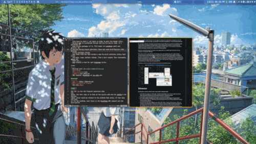

preview all windows
================

Description
-----------
Allows you to preview thumbnails of all open window images on the current display. Clicking a thumbnail will switch to the corresponding application window

I utilized two X11 extensions: the off-screen storage feature of XComposite and XRender, to capture the window image

> [!WARNING]

> If you are using the fullscreen and awesomebar(hidewin) patches, please refer to the comments within my patches and modify the code accordingly to ensure compatibility with the effects of other patches

> Use this patch with picom, or other compositors (it can run without picom, but may not accurately capture the image).

Download
--------
* [dwm-preview-all-windows-6.5.diff](./dwm-preview-all-windows-6.5.diff)

Author
------
* HJ-Zhang - <hjzhang216@gmail.com>
